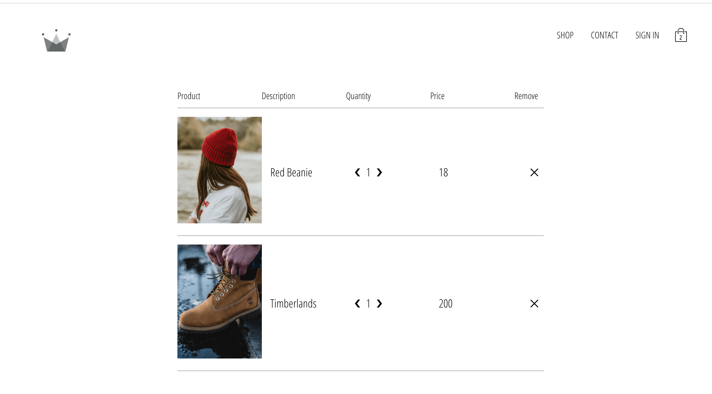

# crwn-ecommerce

Created React Ecommerce Application.User can sign up and then login.they can add Item to cart and process the payment using Stripe Integration.
USer can add or Remove Item from cart 

Technology Stack useed:
React
React Router
Redux for State Managment
Firebase Authetication
Fire Real Time Database
Stripe Payment Integration

